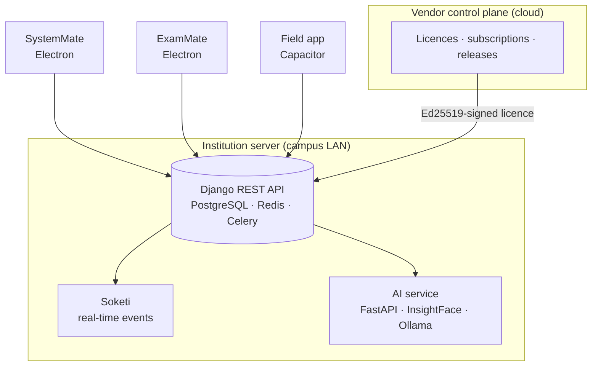

<h1 align="center">AEMMS — Academic &amp; Exam Management Platform</h1>

  A campus-owned platform for colleges: staff desktop, secure student exam client, offline-first field app, on-premises AI, and signed licensing. 
  Designed and built end to end by <a href="https://github.com/flowser"><b>Eng. Felix Nyachio</b></a>, Savvytex Marines Ltd.

  
  
  
  
  
  
  
  

> **This is a showcase repository.** The source code is private and in production use. It describes the product, architecture and engineering. A live walkthrough is available on request — [get in touch](#contact).

---

## Screenshots

  
   <b>SystemMate</b> — exams administration command center (staff desktop)

<table>
  <tr>
    <td width="50%"> <b>SystemMate</b> — exam programme with windows, timetable and results hub</td>
    <td width="50%"> <b>ExamMate</b> — student learning dashboard and exam access</td>
  </tr>
</table>

Screenshots use demo accounts and seeded data.

---

## The products

| Product | Users | What it does |
|---|---|---|
| **SystemMate** | Staff | Desktop app for lessons and LMS content, assessment authoring with maths notation, marking, grading and mark weighting, results release, timetables, and field-supervision boards |
| **ExamMate** | Students | Locked-down desktop client for sitting exams, plus lessons, timetable, results, and an AI study assistant |
| **Field app** | Supervisors | Offline-first mobile app for school visits and industrial-attachment assessment: rubrics, photos, sync when back online |
| **Institution server** | All clients | Multi-tenant API with authentication, background jobs, device workers and real-time events |
| **AI service** | Staff, students | Face verification, retrieval-augmented learning assistant, task agents — all on campus hardware |
| **Vendor control plane** | Savvytex | Signs licences, manages subscriptions and releases |

  

---

## Architecture

  

## Engineering highlights

- **Commercially SaaS, technically campus-owned.** Each institution runs its own server. The vendor issues **Ed25519-signed licence files** that the campus verifies offline, so exams never depend on an internet connection.
- **One API, many clients.** Two Electron desktops, a Capacitor mobile app and the AI service share one Django REST API, layered as controllers → repositories → models.
- **Real-time on a closed LAN.** Live dashboards use a self-hosted Pusher-compatible server (Soketi) instead of a cloud service.
- **AI that stays in the building.** Face verification runs on ONNX Runtime with InsightFace; the learning assistant uses local Ollama models with retrieval over course material. No student data goes to a third-party AI provider.
- **Offline-first field work.** The mobile app captures visits and assessments without connectivity and syncs later.
- **Two regulatory product lines** served from the same architecture, separated by configuration and branding rather than forked logic.
- **Delivery:** Docker Compose for development, Proxmox containers in production, GitHub Actions CI, auto-updating desktop installers for Windows, macOS and Linux.

## Stack

| Layer | Technologies |
|---|---|
| Backend | Python, Django REST Framework, SimpleJWT, PostgreSQL, Redis, Celery, Gunicorn, Nginx |
| Real-time | Soketi (Pusher protocol), Laravel Echo client |
| Desktop | Electron Forge, Vue 3, TypeScript, Pinia, TanStack Query, CKEditor 5, FullCalendar, Tailwind, AdminLTE |
| Mobile | Capacitor, Vue 3, Android |
| AI | FastAPI, InsightFace, ONNX Runtime, OpenCV, Ollama |
| Infrastructure | Docker, Proxmox VE, GitHub Actions |

## In numbers

- **1,400+ commits** across the platform repositories since February 2026
- **6 products** sharing one backend architecture
- Deployed in production on a college campus — see the [campus network case study](https://github.com/flowser/flowser/blob/main/case-studies/chesta-campus-network.md)

---

## Contact

Want a walkthrough, or a platform like this built for your organisation?

  
  
  

© 2026 Savvytex Marines Ltd. All rights reserved. Screenshots and diagrams may not be reused without permission.
